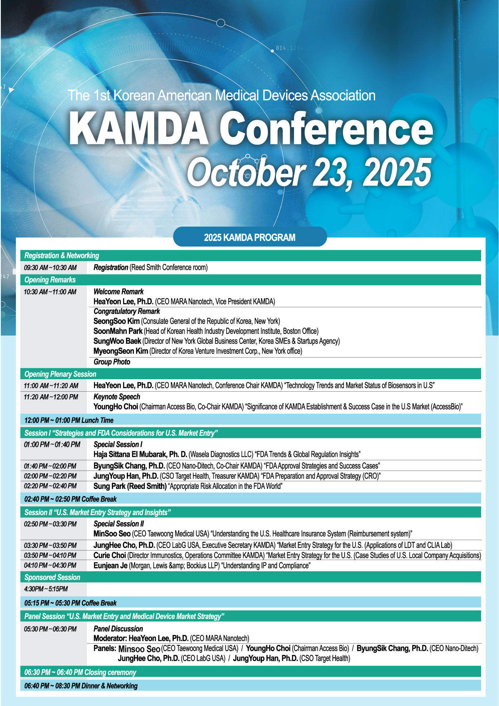

## October 23, 2025

**Korean-American Medical Device Association Annual Conference**

Reed Smith LLP, New York

---

## Schedule

| Time | Session | Speaker / Description |
|------|---------|----------------------|
| 09:30 ~ 10:30 AM | **Registration & Networking** | Reed Smith Conference Room |
| 10:30 ~ 11:00 AM | **Opening Remarks** | Welcome & Congratulatory Remarks |
| 11:00 ~ 11:20 AM | **Opening Plenary Session** | HeaYeon Lee, Ph.D. (CEO MARA Nanotech) |
| 11:20 AM ~ 12:00 PM | **Keynote Speech** | YoungHo Choi (Chairman Access Bio) |
| 12:00 ~ 01:00 PM | **Lunch** | |
| 01:00 ~ 02:40 PM | [**Session I: Strategies and FDA Considerations for U.S. Market Entry**](KAMDA%20Conference%202025%20-%20OCT%2023/Session%20I%20Strategies%20and%20FDA%20Considerations%20for%20U.S.%20Market%20Entry) | Haja Sittana El Mubarak, ByungSik Chang, JungYoup Han, Sung Park |
| 02:40 ~ 02:50 PM | **Coffee Break** | |
| 02:50 ~ 04:30 PM | **Session II: U.S. Market Entry Strategy and Insights** | MinSoo Seo, JungHee Cho, Curie Choi, Eunjean Je |
| 04:30 ~ 05:15 PM | **Sponsored Session** | |
| 05:15 ~ 05:30 PM | **Coffee Break** | |
| 05:30 ~ 06:30 PM | **Panel Session: U.S. Market Entry and Medical Device Market Strategy** | Moderator: HeaYeon Lee |
| 06:30 ~ 06:40 PM | **Closing Ceremony** | |
| 06:40 ~ 08:30 PM | **Dinner & Networking** | |

---

## Available Sessions

- [Session I: Strategies and FDA Considerations for U.S. Market Entry](KAMDA%20Conference%202025%20-%20OCT%2023/Session%20I%20Strategies%20and%20FDA%20Considerations%20for%20U.S.%20Market%20Entry)
  - Haja Sittana El Mubarak - FDA Trends & Global Regulation Insights
  - ByungSik Chang - FDA Approval Strategies and Success Cases
  - JungYoup Han - FDA Preparation and Approval Strategy (CRO)
  - Sung Park - Appropriate Risk Allocation in the FDA World

*More sessions coming soon*
